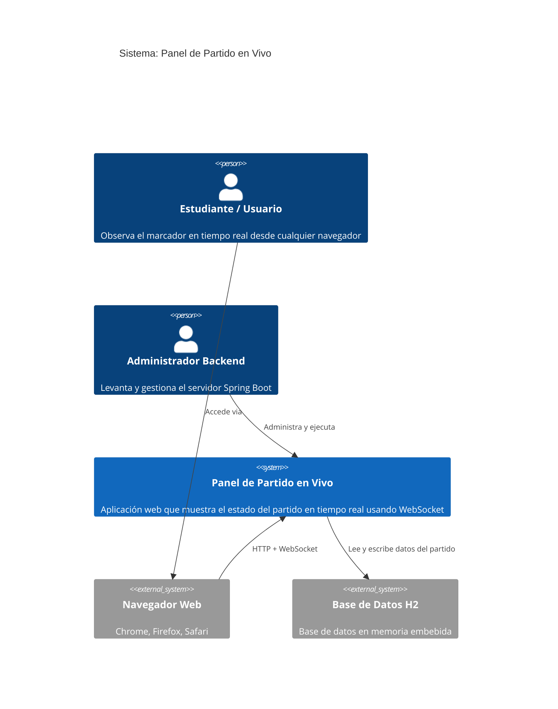
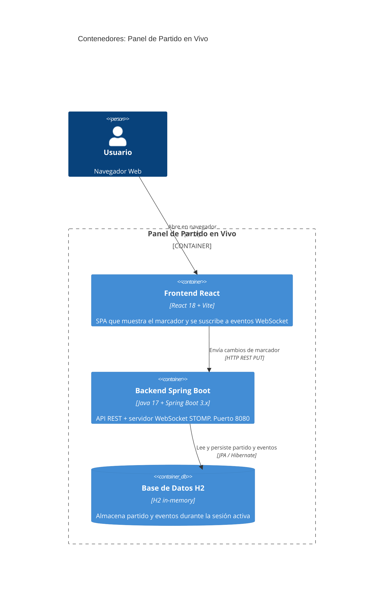
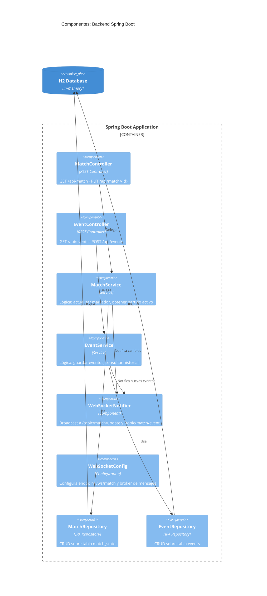
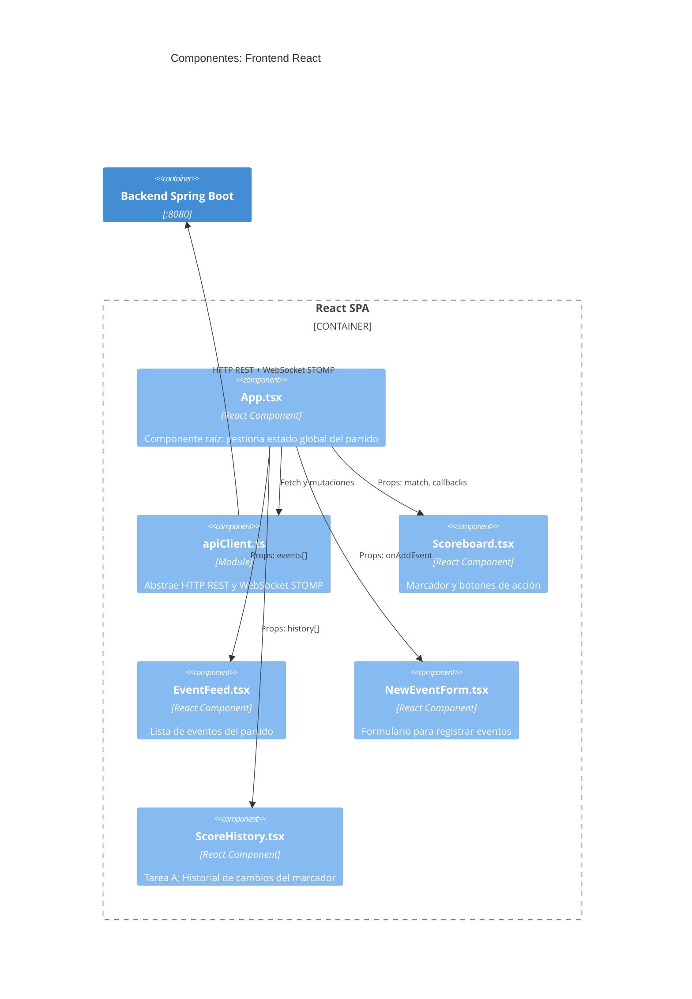
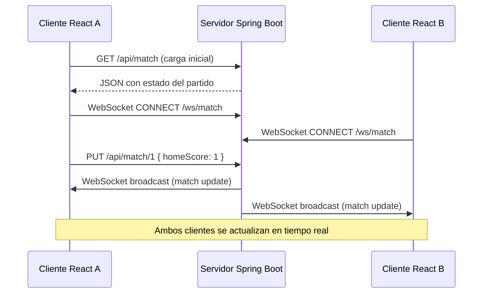

# Arquitectura — Modelo C4

El modelo C4 describe la arquitectura en cuatro niveles de zoom. Aquí se presentan los tres primeros con diagramas Mermaid.

---

## Nivel 1 — Contexto

Muestra el sistema en relación con sus usuarios y sistemas externos.

---

## Nivel 2 — Contenedores

Descompone el sistema en sus piezas técnicas: servidor, cliente y base de datos.

---

## Nivel 3 — Componentes

### Backend

### Frontend

---

## Flujo de datos completo

