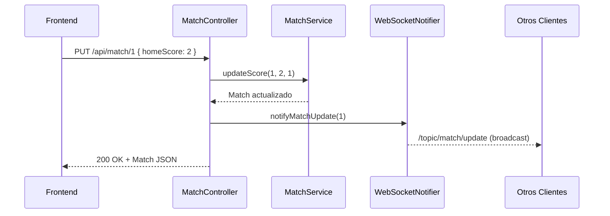
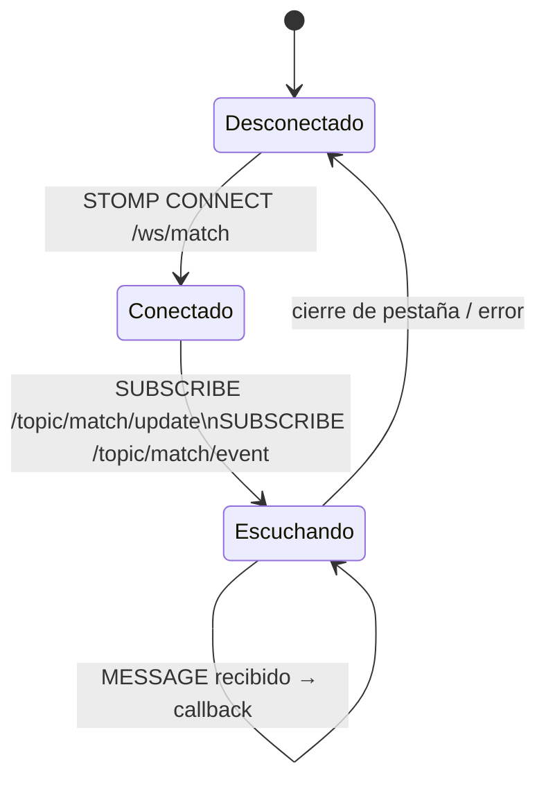

# Backend — Spring Boot

## Configuración inicial

### Requisitos

| Herramienta | Versión mínima |
|-------------|----------------|
| Java | 17+ |
| Maven | 3.8+ |

### Ejecutar el servidor

```bash
cd backend
mvn clean install
mvn spring-boot:run
```

Verifica en `http://localhost:8080/api/match`:

```json
{
  "id": 1,
  "matchName": "Local vs Visitante",
  "homeScore": 0,
  "awayScore": 0
}
```

### `application.properties`

```properties
server.port=8080

spring.datasource.url=jdbc:h2:mem:testdb
spring.datasource.driverClassName=org.h2.Driver
spring.datasource.username=sa
spring.datasource.password=
spring.h2.console.enabled=true
spring.jpa.database-platform=org.hibernate.dialect.H2Dialect
spring.jpa.hibernate.ddl-auto=create-drop
```

:::caution
Con `create-drop` todos los datos se borran al reiniciar el servidor.
:::

---

## API REST

| Método | Endpoint | Descripción |
|--------|----------|-------------|
| GET | `/api/match` | Estado actual del partido |
| PUT | `/api/match/{id}` | Actualiza marcador → broadcast WS |
| POST | `/api/match/{id}/reset` | Reinicia marcador a 0-0 |
| GET | `/api/events` | Historial de eventos |
| POST | `/api/events` | Registra un evento → broadcast WS |

### Flujo: actualizar marcador



---

## WebSocket STOMP

### Configuración

```java
@Configuration
@EnableWebSocketMessageBroker
public class WebSocketConfig implements WebSocketMessageBrokerConfigurer {

  @Override
  public void configureMessageBroker(MessageBrokerRegistry config) {
    config.enableSimpleBroker("/topic");
    config.setApplicationDestinationPrefixes("/app");
  }

  @Override
  public void registerStompEndpoints(StompEndpointRegistry registry) {
    registry
      .addEndpoint("/ws/match")
      .setAllowedOrigins("*")
      .withSockJS();
  }
}
```

### Topics

| Topic | Cuándo se emite | Payload |
|-------|-----------------|---------|
| `/topic/match/update` | Al actualizar o reiniciar marcador | `Match` JSON |
| `/topic/match/event` | Al registrar un nuevo evento | `Event` JSON |

### Ciclo de vida de la conexión



---

## Solución de problemas

| Problema | Solución |
|----------|----------|
| `Port 8080 already in use` | Cambia `server.port` en `application.properties` |
| `CORS error` | El backend ya tiene `@CrossOrigin("*")` en todos los controllers |
| `H2 console` | Abre `http://localhost:8080/h2-console` (usuario: `sa`, sin contraseña) |