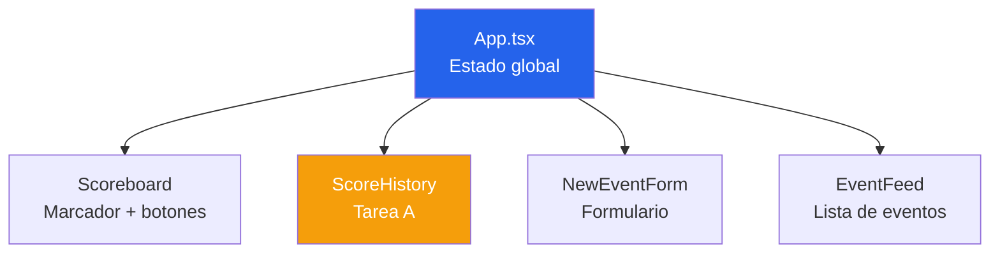
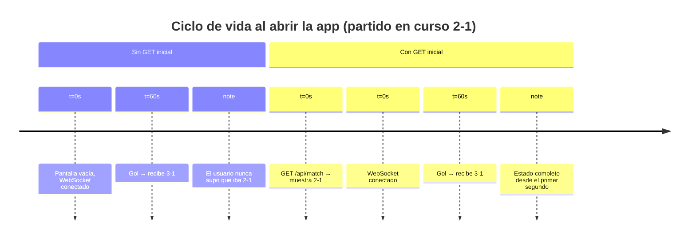
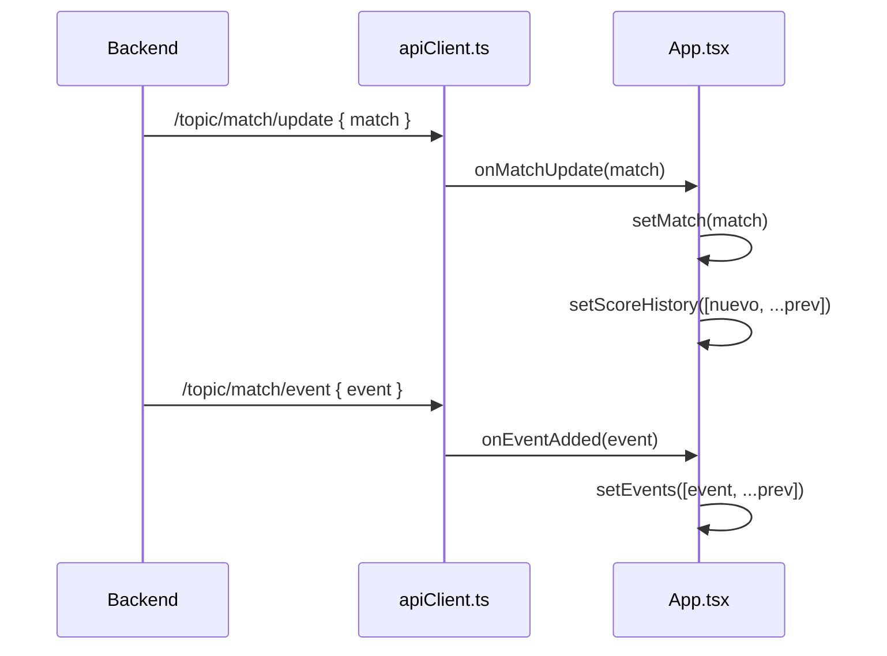

# Frontend — React + Vite

## Instalación y ejecución

```bash
cd frontend
npm install
```

Crea `.env.local`:

```
VITE_API_URL=http://localhost:8080
```

Ejecuta:

```bash
npm run dev
# → http://localhost:5173
```

---

## Componentes



### Estado en `App.tsx`

| Estado | Tipo | Descripción |
|--------|------|-------------|
| `match` | `Match \| null` | Estado actual del partido |
| `events` | `MatchEvent[]` | Historial de eventos |
| `scoreHistory` | `ScoreHistoryEntry[]` | Historial de cambios del marcador |
| `wsStatus` | `string` | Estado de la conexión WebSocket |

---

## Comunicación en tiempo real

El módulo `apiClient.ts` centraliza toda la comunicación:

| Función | Método | Endpoint |
|---------|--------|----------|
| `fetchMatch()` | GET | `/api/match` |
| `fetchEvents()` | GET | `/api/events` |
| `updateScore(id, home, away)` | PUT | `/api/match/{id}` |
| `addEvent(type, min, desc)` | POST | `/api/events` |
| `subscribeToUpdates(...)` | WebSocket | `/ws/match` |

### ¿Por qué GET inicial + WebSocket?



:::info
El WebSocket solo envía eventos que ocurren **después** de conectarse. El `GET` inicial carga el estado actual; el WebSocket mantiene la sincronización en vivo.
:::

### Flujo de actualización

