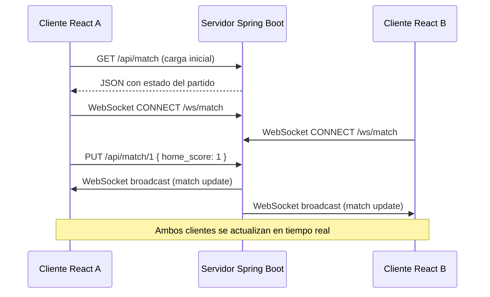
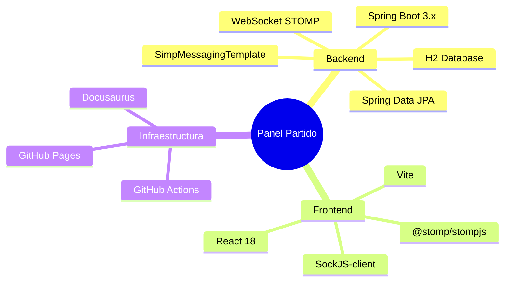

# Panel de Partido en Vivo

**Asignatura:** Desarrollo Web Avanzado  
**Alumna:** Grecia Klarissa Saucedo Sandoval | A00839374  
**Stack:** Spring Boot 3.x · React · Vite · WebSocket STOMP

---

## ¿Qué es este proyecto?

Una mini-aplicación web de **tiempo real** donde varios usuarios conectados ven las actualizaciones de un partido deportivo de forma simultánea. La sincronización ocurre mediante **WebSocket** (sin polling), con un backend Spring Boot que maneja la lógica de negocio y un frontend React que consume los eventos en vivo.

## Estructura del repositorio

```
spring-boot-1/
├── backend/          ← Proyecto Maven / Spring Boot
├── frontend/         ← Proyecto React + Vite
├── SQL/              ← Script de base de datos
├── docs/             ← Esta documentación (Docusaurus)
└── *.md              ← Guías y tareas de laboratorio
```

## Características principales

| Característica | Descripción |
|----------------|-------------|
| **Realtime via WebSocket** | Actualizaciones push sin polling |
| **REST API** | Endpoints para partido y eventos |
| **Base de datos H2** | En memoria, cero configuración |
| **Broadcast** | Todos los clientes reciben cambios al instante |
| **CORS abierto** | Listo para múltiples máquinas en red local |

## Flujo rápido



## Tecnologías



---

Navega por las secciones del menú izquierdo para explorar la arquitectura, los endpoints y las tareas individuales.