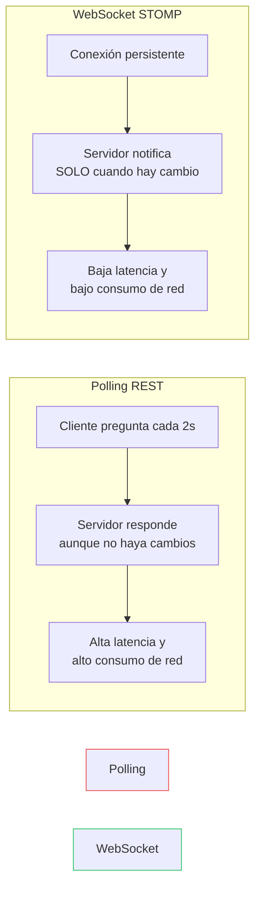

# Preguntas de Reflexión

**Alumna:** Grecia Klarissa Saucedo Sandoval | A00839374

---

## 1. ¿Qué ventajas tiene usar WebSocket vs REST polling?

Con polling el cliente estaría preguntando cada cierto tiempo si ya hubo algún cambio, incluso cuando no ha pasado nada — se mandan requests innecesarios. Con WebSocket la conexión se queda abierta y el servidor avisa justo cuando hay un cambio. Eso hace que haya menos tráfico, todo sea más rápido y funcione mejor cuando hay muchos usuarios conectados.

---

## 2. ¿Qué pasaría si el servidor se reinicia? ¿Qué datos se pierden?

Se pierde todo. Como se está usando H2 en memoria con `create-drop`, en cuanto el servidor se apaga, la base de datos desaparece. El marcador vuelve a cero y no queda registro de nada. Además, el historial no se persiste en el backend sino en el estado de React, así que también se pierde si recargas la página.

---

## 3. ¿Cómo diferencia el servidor quién envía cada cambio?

Realmente no lo hace. No hay autenticación, entonces cualquier cliente puede mandar un `PUT` y el servidor lo acepta sin saber quién fue. En una aplicación real se necesitaría autenticación, como JWT, para identificar a cada usuario.

---

## 4. ¿Por qué el frontend necesita hacer GET inicial + WebSocket y no solo WebSocket?

Porque el WebSocket solo manda lo que pasa **después** de conectarse. Si entras cuando el marcador ya va 2-1, el WebSocket no te lo dice — solo te avisará cuando haya otro cambio. Por eso primero se hace un `GET` para traer el estado actual, y luego el WebSocket se encarga de ir actualizando todo en tiempo real. Si no hicieras el GET, la pantalla estaría vacía hasta que pasara algo nuevo.