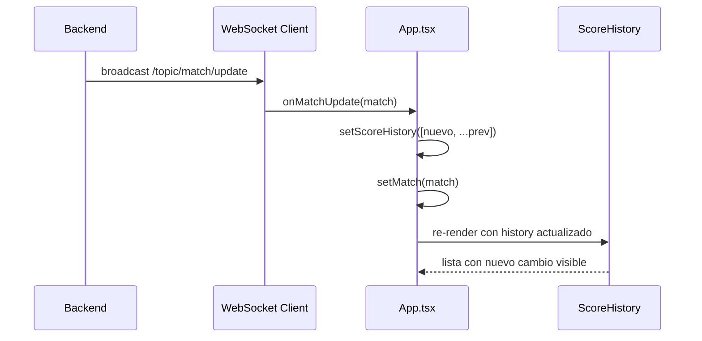

# Tarea A — Historial de Cambios del Marcador

**Feature:** Acumular eventos de marcador desde WebSocket

## ¿Qué construye?

Un registro visual que muestra cada cambio de puntuación con su hora:

```
Historial del marcador
1 - 0    14:32:45
1 - 1    14:39:12
2 - 1    14:51:30
```

## Archivos a crear/modificar

| Acción | Archivo |
|--------|---------|
| Crear | `src/components/ScoreHistory.tsx` |
| Modificar | `src/App.tsx` (estado + callback WebSocket) |

## Componente `ScoreHistory.tsx`

```tsx
interface ScoreHistoryEntry {
  homeScore: number;
  awayScore: number;
  timestamp: string;
}

export default function ScoreHistory({ history }: { history: ScoreHistoryEntry[] }) {
  if (history.length === 0) return null;

  return (
    <div>
      <h3>Historial del marcador</h3>
      <ul>
        {history.map((entry, i) => (
          <li key={i}>
            <strong>{entry.homeScore} - {entry.awayScore}</strong>
            <span>{new Date(entry.timestamp).toLocaleTimeString()}</span>
          </li>
        ))}
      </ul>
    </div>
  );
}
```

## Cambios en `App.tsx`

```tsx
// 1. Estado para el historial
const [scoreHistory, setScoreHistory] = useState<ScoreHistoryEntry[]>([]);

// 2. En el callback onMatchUpdate del WebSocket
(updated) => {
  setScoreHistory(prev => [
    {
      homeScore: updated.homeScore,
      awayScore: updated.awayScore,
      timestamp: new Date().toISOString(),
    },
    ...prev,  // más reciente primero
  ]);
  setMatch(updated);
}

// 3. Renderizar el componente
<ScoreHistory history={scoreHistory} />
```

## Flujo de la tarea

